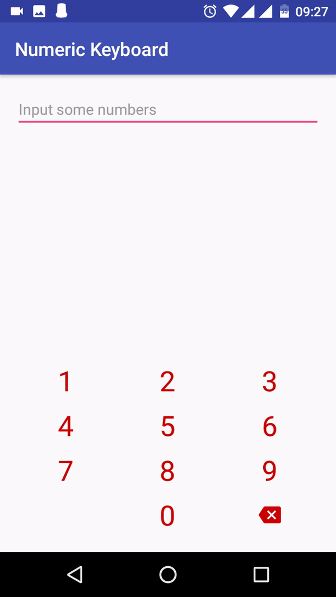
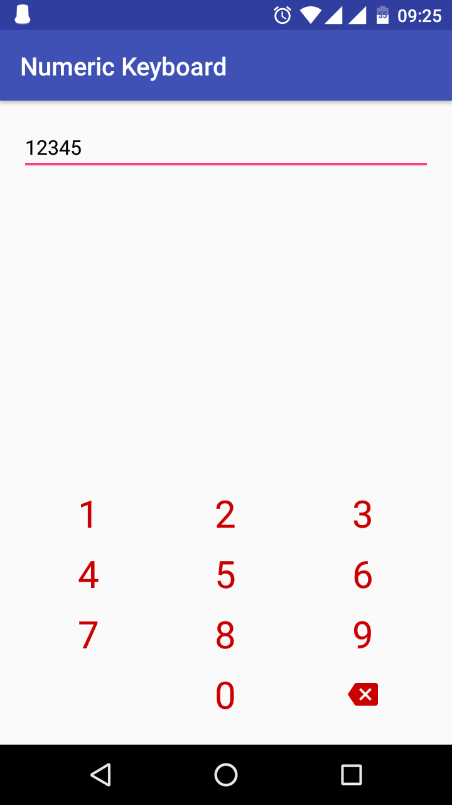
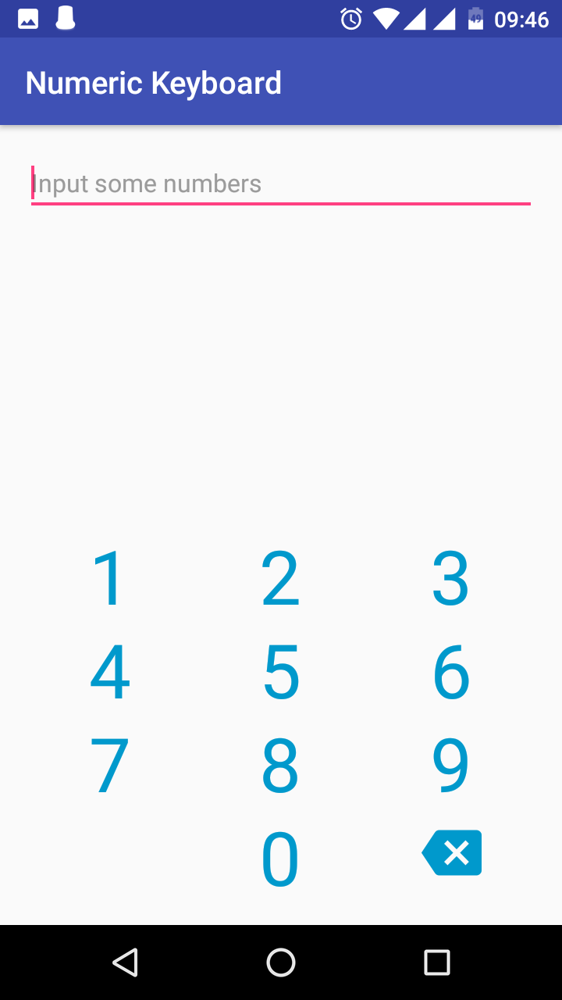

# Numeric Keyboard
[](https://bintray.com/konaire/maven/numeric-keyboard)
[](https://github.com/konaire/NumericKeyboard/blob/master/LICENSE.txt)


<details>
  <summary>More screenshots</summary>
  
  
</details>

## Description
It's simple numeric keyboard which can't be hidden. Keyboard prevents your `EditText` from being focused, so android keyboard won't be displayed. It supports all features of default keyboard and can be customize in many different ways.

Library was written in Kotlin language. So it will be perfectly matched with your new awesome projects :wink:

## Installation
The Gradle dependency is available via [jCenter](https://bintray.com/konaire/maven/numeric-keyboard). jCenter is the default Maven repository used by Android Studio. The minimum API level supported by this library is API 15.

```java
dependencies {
    // other dependencies here
    compile 'com.konaire.numeric-keyboard:numeric-keyboard:1.0.3'
}
```

## Usage
### From layout resource
You can set background, width, margin, etc. from android xml attributes. And there are some more of them:  
**app:field** - reference to `EditText` for input  
**app:fieldMaxLength** - max length of your `EditText` if it has one  
**app:keyHeight** - height of each key in keyboard  
**app:keyTextColor** - text color for each key  
**app:keyTextSize** - text size for each key

_Note:_ If your `EditText` has **android:maxLength** attribute but you don't provide **app:fieldMaxLength** for keyboard, a `TextWatcher` will be called after max length is reached while inputting.

In the following example keyboard was initialized from layout.

```xml
<FrameLayout
    xmlns:android="http://schemas.android.com/apk/res/android"
    android:layout_width="match_parent"
    android:layout_height="match_parent">

    <EditText
        android:id="@+id/code"
        android:layout_width="match_parent"
        android:layout_height="wrap_content"
        android:inputType="number"
        android:hint="@string/hint"
        android:textSize="@dimen/text_size"
        android:textColor="@android:color/black" />

    <!-- Some other stuff -->

    <com.konaire.numerickeyboard.NumericKeyboard
        android:layout_width="match_parent"
        android:layout_height="wrap_content"
        android:layout_marginBottom="@dimen/gap"
        android:layout_gravity="bottom"
        app:field="@+id/code"
        app:keyTextColor="@color/green" />
</FrameLayout>
```

### From code
You can set all of custom parameters from code. There is an example:

```kotlin
// other imports
import kotlinx.android.synthetic.main.activity_main.*

class MainActivity: AppCompatActivity() {
    override fun onCreate(savedInstanceState: Bundle?) {
        super.onCreate(savedInstanceState)
        setContentView(R.layout.activity_main)

        keyboard.field = field
        keyboard.fieldMaxLength = 10
        keyboard.keyTextColor = Color.GREEN
    }
}
```

# License
The library is distributed under the [MIT LICENSE](https://github.com/konaire/NumericKeyboard/blob/master/LICENSE.txt).
